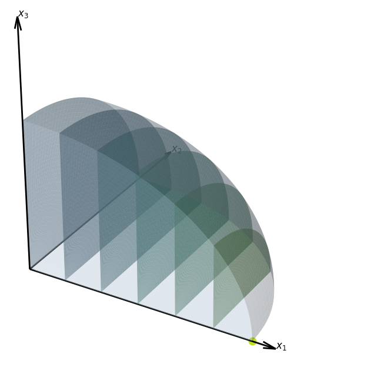

# VI ERMAC_AIOE

Repositório acadêmico do algoritmo AIOE para submissão ao VI ERMAC 2026 (Salvador-BA). Contém PDF, animações e códigos.

Repositório oficial para o trabalho submetido ao **VI Encontro Regional de Matemática Aplicada e Computacional (ERMAC-BA)**, realizado em Salvador.

## 📝 Resumo
Este projeto apresenta o **Algorithm for Integer Optimization in Ellipsoids (AIOE)**. O foco da pesquisa é a otimização global em conjuntos convexos discretos utilizando fatiamento inteligente orientado pelos semieixos de menor magnitude.

### Diferenciais Técnicos:
* **Estratégia de Fatiamento**: Redução de dimensão n → 2 priorizando eixos menores.
* **Complexidade**: O(n⌊a₂⌋ⁿ⁻¹).
* **Visualização**: Implementação de funções de fronteira fₐ e gₐ para varredura de vizinhança.

## 📐 Metodologia e Visualização

### 1. Fatiamento: Redução de Dimensão ($n → 2$)
O processo inicial do algoritmo consiste no fatiamento do elipsoide, isolando subespaços bidimensionais para viabilizar a busca exata. Abaixo, a ilustração da projeção no $ℝ³$:

---

### 2. Comportamento do Algoritmo no Plano (ℝ²)
Após a redução de dimensão, o algoritmo executa a dinâmica de busca na fronteira. A animação abaixo detalha o deslocamento iniciando pelo salto vertical (fₐ) no **eixo menor (x₂)**, seguido pelos ajustes horizontais (gₐ):

* ▶️ [Assistir Animação do Deslocamento no YouTube](https://youtu.be/oF_kb5ebEnQ?si=rUEq3d32lTgR5pVV)

## 👤 Autores
* **Marcos Vinícius Barreto dos Santos** (UFRB)
* **Lucas Ivonovith Peixoto Vilas Boas** (UFRB)
* **Dr. Eleazar Gerardo Madriz Lozada** (Orientador - UFRB)
